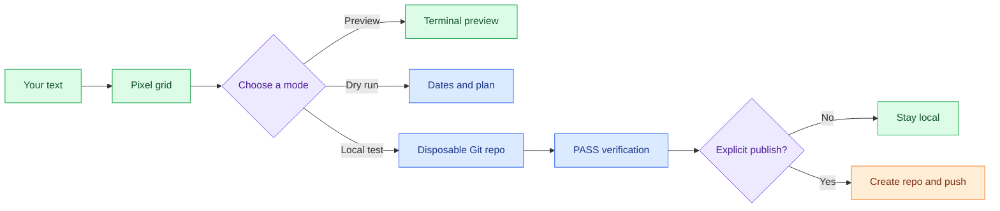

<div align="center">
  <h1>Commit Art</h1>
  <p><strong>Turn Git contribution calendars into pixel art you can preview, verify, and publish.</strong></p>
  <p>
    <a href="https://github.com/ConnorSawaya/commit-art/actions/workflows/ci.yml"></a>
    
    
    
  </p>
  <p>
    <a href="#quick-start">Quick start</a> |
    <a href="#choose-your-mode">Choose a mode</a> |
    <a href="#visual-workflow">Visual workflow</a> |
    <a href="#interactive-controls">Controls</a> |
    <a href="#safety-first">Safety</a>
  </p>
</div>

> [!NOTE]
> Preview, dry-run, local-test, and interactive modes stay local. `--publish` is the only command that calls GitHub or pushes.

> [!WARNING]
> Generated history is back-dated art, not proof of work. Use it honestly.

## Preview

<p align="center">
  <a href="https://github.com/ConnorSawaya/commit-art/blob/main/docs/contribution-preview.png?raw=1">
    
  </a>
</p>

<p align="center"><sub>Click the preview to open the full-size PNG.</sub></p>

## Quick Start

```bash
python commit_art.py "HELLO" --preview --view github
python commit_art.py "HELLO" --local-test
```

`--preview` creates zero commits. `--local-test` builds a disposable local
repository, writes real commits, and verifies every date and identity.

### Terminal preview

```
┌──────────────────────────┐
│ CONTRIBUTION ART PREVIEW │
├──────────────────────────┤
│ ██      ██  ██████       │
│ ██      ██    ██         │
│ ██      ██    ██         │
│ ██████████    ██         │
│ ██      ██    ██         │
│ ██      ██    ██         │
│ ██      ██  ██████       │
└──────────────────────────┘
```

## Choose Your Mode

| Mode | Command | Commits | Network |
| --- | --- | ---: | ---: |
|  **Preview** | `--preview` | No | No |
|  **Dry run** | `--dry-run` | No | No |
|  **Interactive** | `--interactive` | Only after you choose Build | No |
|  **Full-screen TUI** | `--tui` | Only after you choose Build + Verify | No |
|  **Publish** | `--publish` | Yes | GitHub + push |

<details>
<summary><strong>See the recommended workflow</strong></summary>

1. Preview the word with `--preview --view github`.
2. Inspect all planned dates with `--dry-run`.
3. Run `--local-test` to verify a disposable repository.
4. Publish only when you have reviewed the output and explicitly confirm.

</details>

## Visual Workflow



## How contribution calendars work

GitHub renders ~52-53 columns (weeks) × 7 rows (Sunday-Saturday).
Each cell's shade reflects commit count on that date. This tool maps
each "on" pixel of a 5×7 font to a calendar date
(`date = start_sunday + week*7 + weekday`) and creates that many Git
commits with explicit `GIT_AUTHOR_DATE` / `GIT_COMMITTER_DATE`, then
verifies the history with `git log` itself.

> Honesty note: back-dated art shows *when commits claim to be*, not real
> work done - don't use generated activity to misrepresent project
> participation or work history.

## Publishing to GitHub (opt-in)

> [!CAUTION]
> This is the one mode that creates back-dated history on GitHub and pushes it. Preview and verify locally first.

<details>
<summary><strong>Show the publish steps</strong></summary>

```bash
python commit_art.py "HELLO" --publish --repo my-art
```

1. Uses your existing `gh` login (`gh auth login` first) - no tokens
   handled here. Commits are authored as your account (name + primary
   or noreply email) so squares attribute to you.
2. Asks you to **type the repo name to confirm** (`--yes` skips the
   prompt), then creates a **private** repo by default (`--public` to
   change that).
3. Builds the commits fresh and verifies them locally.
4. Pushes once to `main` and prints the URL.

Private repos only shade your graph if "Private contributions" is
enabled in GitHub profile settings. Honesty note still applies:
back-dated art shows *when commits claim to be*, not real work done -
don't use it to misrepresent your history.

</details>

## Installation

Requires Python 3.10+ and `git`. The core CLI uses only the Python
standard library. The test suite uses `pytest`; the optional full-screen
TUI uses `textual`; publishing uses the GitHub CLI (`gh`).

```bash
pip install -r requirements.txt   # pytest only, for the test suite
```

## Interactive mode

```bash
python commit_art.py --interactive   # or -i
```

Full-screen TUI: artwork on top, menu below. In a real terminal use
**Up/Down + Enter** (letter shortcuts also work); when piped, plain
letter/Enter input is used instead. The screen fully redraws on every
action. Menu: new text, build + verify (`T`), dry-run (`D`), brightness
(`C`), auto-wrap (`W`), start date (`S`), two-line mode (`2`), view
toggle (`G`), backup (`B`), quit (`Q`). Typing new text always resets to
single-line mode; blank line 1 in the `2` dialog exits two-line mode.

## Full-screen TUI (optional)

```bash
pip install textual
python commit_art.py --tui
```

A real Textual app (terminals can't render HTML/CSS/JS - that's
browser-only tech - so this uses a terminal-UI framework instead):
artwork panel on the **left**, stats + settings + action buttons on the
**right**, scrolling log at the **bottom**, everything visible at once.
Type and the art re-renders live; `Build+Verify` runs the real commit
backend in a worker thread with milestone lines in the log and prints
PASS/FAIL there too. Keys: type in the fields, `Esc` to unfocus, then `t`/`d`/`g`/`b`
shortcuts work (`q` quits). Small terminals scroll each panel.

Colors, banner, and progress bar show in a real terminal (auto-disabled
when piped or with `NO_COLOR=1` / `--no-color`). Key lines
(`RESULT: PASS`, `DRY RUN COMPLETE`, …) stay plain-text greppable.

## Interactive Controls

<details open>
<summary><strong>Legacy interactive menu</strong></summary>

| Key | Action |
| --- | --- |
| <kbd>Up</kbd> / <kbd>Down</kbd> + <kbd>Enter</kbd> | Navigate and select |
| <kbd>T</kbd> | Build and verify |
| <kbd>D</kbd> | Show the dry-run plan |
| <kbd>C</kbd> | Change brightness |
| <kbd>W</kbd> | Toggle auto-wrap |
| <kbd>S</kbd> | Change the start date |
| <kbd>2</kbd> | Configure two-line mode |
| <kbd>G</kbd> | Toggle blocks or GitHub view |
| <kbd>B</kbd> | Export or restore backups |
| <kbd>Q</kbd> | Quit |

</details>

<details>
<summary><strong>Full-screen TUI shortcuts and buttons</strong></summary>

| Input | Action |
| --- | --- |
| Text fields | Update the artwork live |
| <kbd>Esc</kbd> | Leave the active field |
| <kbd>T</kbd> | Build and verify |
| <kbd>D</kbd> | Run a dry run |
| <kbd>G</kbd> | Toggle the view |
| <kbd>B</kbd> | Create a backup |
| <kbd>Q</kbd> | Quit |

</details>

## Usage

<details open>
<summary><strong>Common commands</strong></summary>

```bash
python commit_art.py "HELLO" --preview        # boxed preview, zero commits
python commit_art.py "HELLO" --preview --view github  # GitHub-calendar look
python commit_art.py "HELLO" --dry-run        # full plan + every date, zero commits
python commit_art.py "HELLO" --local-test     # disposable repo in ./test-output/HELLO/
python commit_art.py "HELLO" --local-test --backup    # + zip repos into backups/
python commit_art.py --list-backups           # list backup zips
python commit_art.py --restore backups/<file>.zip     # restore into test-output/
python commit_art.py "HELLO" --dry-run --export-plan backups/HELLO-plan.json
python commit_art.py "LONG PHRASE" --auto-wrap --dry-run
python commit_art.py --line1 "HELLO" --line2 "WORLD" --local-test
python commit_art.py "HELLO" --start 2026-01-04 --local-test   # must be a Sunday
python commit_art.py "HELLO" --commits-per-pixel 5 --dry-run
python commit_art.py --help
```

</details>

## Examples (real output)

Single line:

```text
$ python commit_art.py "HELLO" --preview
Text: HELLO
Width: 29 weeks
Available: 52 weeks
Usage: 55.8%
Active pixels: 73
Commits/pixel: 3
Estimated commits: 219
Layout: SINGLE LINE
```

Two stacked lines, GitHub-calendar view (`--line1 HI --line2 YO
--preview --view github`) - top band and bottom band share the same
weeks; Wednesday stays empty (gap row):

```text
    JuAu        Se
    ▒▒ ·· ▒▒ ·· ▒▒ ▒▒ ▒▒
Mon ▒▒ ▒▒ ▒▒ ·· ·· ▒▒ ··
    ▒▒ ·· ▒▒ ·· ▒▒ ▒▒ ▒▒
Wed ·· ·· ·· ·· ·· ·· ··
    ▒▒ ·· ▒▒ ·· ·· ▒▒ ··
Fri ·· ▒▒ ·· ·· ▒▒ ·· ▒▒
    ·· ▒▒ ·· ·· ·· ▒▒ ··

Less ░░ ▒▒ ▓▓ ██ More  (3 commits/pixel)
```

Local test verdict (`--local-test` builds a disposable repo and checks
it with git itself):

```text
Wrote 28 commits.
PASS
  log_parseable: ok
  commit_count_match: ok
  all_dates_present: ok
  no_unexpected_dates: ok
  author_dates_match: ok
  committer_dates_match: ok
  no_future_dates: ok
RESULT: PASS
```

## How automatic wrapping works

A 5-wide font with 1-column spacing needs ~6 week-columns per character,
so 52 weeks fit ~8 characters per line. If text doesn't fit and
`--auto-wrap` is given, the layout engine tries every word-boundary split
and picks one where both lines fit with the most balanced widths - never
splitting mid-word unless a single word is too long.

## How two-line (stacked) mode works

One line uses the full 7-row font. Two lines (`--line1/--line2` or
`--auto-wrap`) switch to a compact 3-row font and stack for real: line 1
on rows 0-2, one gap row, line 2 on rows 4-6 - 3+1+3 fills all 7 rows,
both lines in the **same** week columns, one date range, one calendar.
Three rows cannot render every letter distinctly, so the glyphs are
best-effort blocky (uniqueness is enforced by test) - but letters sit
truly on top of each other.

## How estimates are calculated

- `pixel width` = rendered columns (chars + spacing); 1 column = 1 week
- `active pixels` = filled cells; `estimated commits` = pixels × commits-per-pixel
- `usage %` = widest line ÷ `--max-weeks` × 100
- `fits` = every line ≤ `--max-weeks` (advisory; `--local-test` still works,
  the art just spans more than one on-screen year)

## How dates work

- Default `--start auto` ends art on the last **fully past** week, so no
  future commits are ever created (even on Fridays).
- Explicit `--start` must be a Sunday; ranges ending after today are rejected.
- Pure `datetime.date` arithmetic → leap years and year boundaries just work.
- Every date function takes an explicit `today` parameter → deterministic tests.

## Brightness / intensity

`--commits-per-pixel 1..10` (default 3) controls the number of commits
written for every active pixel. Higher values make the contribution cells
appear darker on GitHub.

## Safety First

- Local modes use no remotes, GitHub API, or `--global` config. The local
  Git backend rejects push attempts; `--publish` is the sole explicit push
  path.
- Disposable repos under `./test-output/` use the fake identity
  `Contribution Art Test <contribution-art-test@example.invalid>`.
- Every `--local-test` re-verifies count, dates, author/committer stamps,
  and future-date absence, printing PASS/FAIL.

## Backend: real commits + backups

- **Real commits**: `--local-test` actually runs `git init / add / commit`
  per pixel with explicit `GIT_AUTHOR_DATE` + `GIT_COMMITTER_DATE`, then
  inspects the history via `git log` - not a mock frontend.
- **Backups**: `--local-test --backup` zips `test-output/` (including
  `.git` history) into `backups/commit-art-backup-<stamp>.zip`;
  `--list-backups` / `--restore <zip>` manage them. Interactive mode's
  `B` menu exports the current plan (JSON), zips repos, or lists backups.
- **Two views**: `--view blocks` (default) or `--view github` - the GitHub
  view shows week columns with month headers, Mon/Wed/Fri row labels,
  intensity shading (`░░▒▒▓▓██`) scaled by commits-per-pixel, and a
  Less→More legend. Toggle live with `G` in interactive mode.

## Project structure

```text
commit-art/
├── commit_art.py          # CLI: preview / dry-run / local-test / publish
├── tui.py                 # full-screen Textual app (optional, --tui)
├── contribution_art/
│   ├── font.py            # 7-row font + 3-row stacked font (easy to extend)
│   ├── renderer.py        # grids, Unicode + GitHub-calendar rendering
│   ├── layout.py          # measuring, auto-wrap, single/stacked planning
│   ├── dates.py           # Sunday-anchored, never-future date math
│   ├── git_writer.py      # local-only commits (push raises here)
│   ├── verifier.py        # inspects git log, prints PASS/FAIL
│   ├── publish.py         # opt-in --publish via `gh` CLI (sole push path)
│   ├── backup.py          # plan export + repo zip/restore
│   ├── cli_ui.py          # colors, banners, progress (stdlib ANSI)
│   ├── keys.py            # arrow-key reading (msvcrt/termios)
│   └── tui_text.py        # panel text builders for the TUI
├── tests/                 # pytest suite (stdlib + pytest only)
├── .github/workflows/ci.yml
├── README.md
└── requirements.txt
```

## Limitations

- Very long phrases can overflow one screen-year; stacked mode reports
  DOES NOT FIT honestly instead of pretending.
- Stacked glyphs are blocky (3 rows can't match 7-row detail).
- Shades depend on the viewer's theme; commit counts only approximate color.
- `--publish` pushes fabricated history to your own repo - it shows when
  commits claim to be, not real work; don't misrepresent it.
